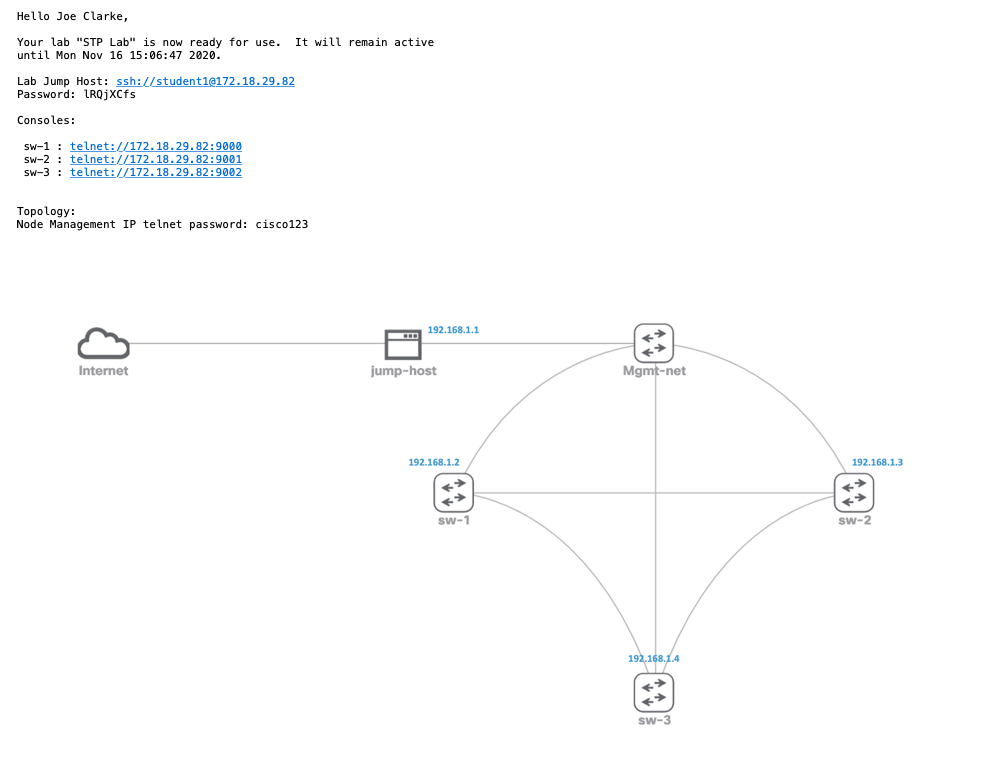

# Cisco Modeling Labs Class Automation

## Introduction

This project shows how you can automate class-like lab delivery using [Cisco Modeling Labs](https://developer.cisco.com/modeling-labs) (CML) and a simple SQLite-based
database for tracking lab schedules and students.  This solution makes heavy use of the CML REST API via its Python
Client Library.

In a nutshell, this solution does the following:

* You schedule a lab to run for a set number of students at a specific time
* A watchdog script will deploy the labs at the given time and then email the students
* After the lab time window has expired, another watchdog script will archive the labs' configurations, stop them, and delete them from the CML server

## Requirements and Installation

This solution requires Python 3.7 or higher.  To get started, do the following:

```shell
python -m venv venv
source venv/bin/activate
pip install -r requirements.txt
```

## Getting Started

Once the requirements are installed, modify the included `config.json` file to match your required parameters.  The fields in this file are as follow:

* `cml_server`: IP address or hostname of the CML server
* `cml_username`: Admin username to use to login to the CML server
* `cml_password`: Password to use to login to the CML server
* `configs_base`: Local directory containing all configs for the labs
* `labs_base`: Local directory containing all lab definitions
* `smtp_server`: IP address or hostname of an SMTP server to use to send email
* `smtp_tls`: (optional) Either true or false if the SMTP server requires TLS/SSL
* `smtp_port`: (optional) TCP port to use for the SMTP server (default: 25)
* `archives_base`: Local directory into which lab archives will be written prior to shutting down labs
* `db_file`: Path to the database file used to track scheduling and students
* `email_from`: Address from which email will be sent

You will need to define one or more lab definitions from which new lab instances will be created.  An example `STP_Lab.yaml` file is included.  The best way to
create these lab definitions is to build a lab in CML exactly how you want each student to see it.  Always include an Ubuntu node alled "jump-host" that is connected
to an external-connector configured as a _bridge_.  On the other interface of the jump-host, connect an unmanaged switch called "Mgmt-net".  And to this switch, connect
all of your lab devices that the students will be configuring.  The jump-host node must get its IP address via DHCP.  See the `STP_Lab.yaml` file as an example.  This file
can be imported into CML to see how the topology looks.  Once you have built your lab, download it from CML and same it to the `labs_base` directory.

After you create your lab definition, take a screenshot of the topology itself and save that as a PNG file in the same `labs_base` directory.  Call it the same name as the
lab definition file with a `.png` extension.  See the included `STP_Lab.png` file as an example.

Next, create a JSON file to represent the lab to be scheduled.  An example `stp-schedule.json` file is provided.
The syntax of this file is as follows:

* `id`: A unique UUID to use for the lab.  There are many tools that can generate a UUID.  You can do this with the Python one-liner: `python -c 'import uuid;print(uuid.uuid1())'`
* `students`: A list of one or more students' usernames for which the lab will be deployed (students will receive an email once their lab instance has been scheduled)
* `labdef`: Name of the lab definition file found in the `labs_base` directory without any extension; this will be the lab that is deployed for each student
* `start_time`: The date and time to start the lab in the format YYYY-MM-DD hh:mm
* `duration`: The time (in hours) that the lab will run
* `device_password`: The password configured to access devices in the lab (this will not be the jump host password the student uses to get into the lab itself)

Next, run the included `add-student.py` script to add each student to the database.  If the database doesn't yet exist, it will be automatically created.
For example:

```shell
./add-student --username jdoe --name "Jane Doe" --email jdoe@example.com
```

Note: Only the student's username needs to be unique.  

Then schedule the lab using the included `schedule-lab.py` script.  For example, if you created a `my-lab-schedule.json` file with the lab scheduling details:

```shell
./schedule-lab -c config.json -l my-lab-schedule.json
```

At this point, one or more lab instances are scheduled in the future.

## Deploying The Labs

The included `deploy-lab.py` script is designed to be run continuously, checking the database for new labs to deploy (and sleeping for one minute when there
isn't any work to do).  It will write any messages to its controlling terminal.  Run this script in its own terminal:

```shell
./deploy-lab.py -c config.json
```

When it's time to deploy a lab, the script will spawn threads for each instance.  It will automatically create new accounts for the students (if they don't exist)
on the CML server.  Then, it will use those accounts to create the labs.  This way, each student's lab is isolated from the other students.  However, as of CML 2.1,
administrators will be able to see all students' labs.

When the labs have been successfuly configured and started, each student will receive an email with access info and a screenshot of the topology (if you created one for
the lab definition).  For example:



The students can then interact with the lab nodes either using the console ports or, if a management network was provided in the lab definition, the management IP
addresses of each node.  Note: students never need to access CML directly.

In order for the students to access their lab instance, the deploy script sets up the CML _breakout utility_ on the jump-host node that was described above.  Access
to the jump-host is controlled via a randomly-generated password that will be sent to the students in the email.

## Stopping The Labs

The final script that is included with the solution is `stop-lab.py`.  This script, like `deploy-lab.py` should be run in its own terminal and will run in a loop
looking for lab instances whose times have expired.  When instances are found, this script will do the following:

* Archive the running configuration from each device to the `archives_base` directory (_note:_ only certain devices support config extraction)
* Stop the lab
* Wipe lab state and remove the lab
* Set the state of the lab to "HISTORIC" in the database
* Delete the student user account from CML (assuming no other labs exist for the student)
